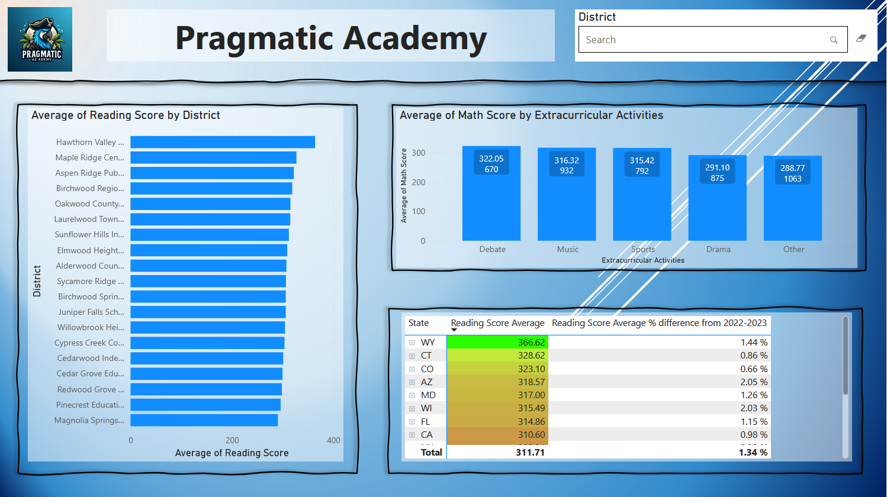
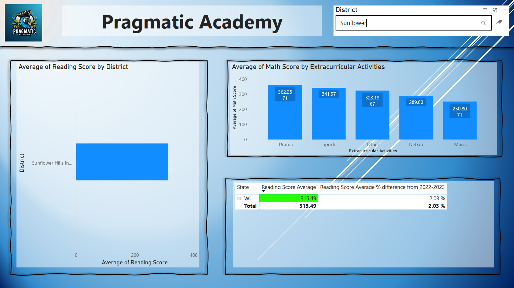
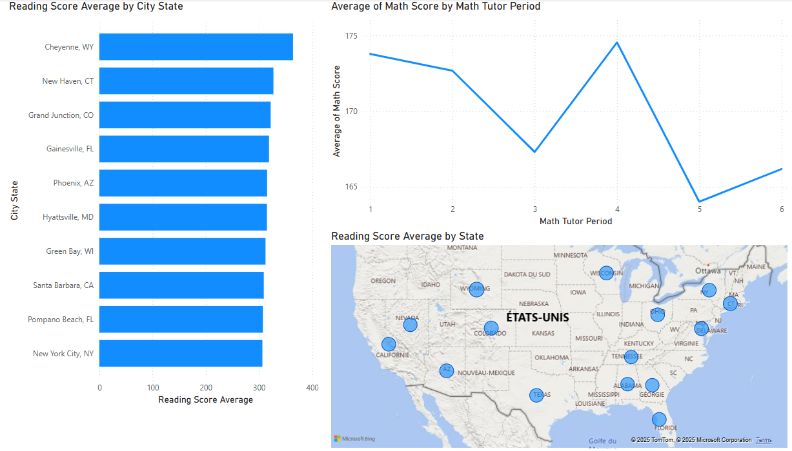

# 📊 Power BI Report – Student Tutoring Data (Pragmatic Works Tutorial)

This project is based on a full Power BI tutorial by **Pragmatic Works**.  
It walks through the process of creating a complete dashboard from public education data related to student tutoring and performance.

---

## 🎯 What I Learned

### ✅ Data Preparation & Cleaning
- Connected to online datasets from **GitHub (raw CSV format)**
- Cleaned column names and corrected data types
- Handled missing values and ensured consistent formatting

### ✅ Report Building
- Built interactive reports using slicers and filters by **city, district, and state**
- Integrated **search functionality** for quick filtering
- Designed clean, user-friendly visuals

### ✅ Power BI Features
- Used basic **DAX** formulas for calculated columns and custom measures
- Leveraged **AI visuals** (decomposition tree, smart narratives, etc.)
- Managed **cross-filtering** and interactions between visuals
- Used **tooltips** and dynamic elements to enhance usability

### ✅ Deployment & Automation
- Published the report to **PowerBI.com**
- Set up **automatic refresh**
- Shared the live dashboard through the Power BI Service

---

## 🗂 Datasets Used

All datasets were accessed directly via raw GitHub URLs:

- 📘 [`StudentTestingData.csv`](https://raw.githubusercontent.com/PragmaticWorksTraining/Datasets/refs/heads/main/Education/StudentTestingData.csv)  
- 📘 [`StudentData.csv`](https://raw.githubusercontent.com/PragmaticWorksTraining/Datasets/refs/heads/main/Education/StudentData.csv)

---

## 🎥 Tutorial Reference

- 📺 [Full Power BI tutorial by Pragmatic Works (YouTube)](https://www.youtube.com/watch?v=Dk25lwdTKow)

---

## 🧪 Tools Used

- Power BI Desktop
- Power Query
- DAX (basic usage)
- Power BI Service (cloud sharing and scheduled refresh)
- GitHub for dataset access

---
## 🖼️ Dashboard Preview

---
## 📁 Author

Fares – Master’s student in Mathematics & Statistical Learning, Université Paris-Saclay  
> GitHub: [github.com/Fares596](https://github.com/Fares596)

---
